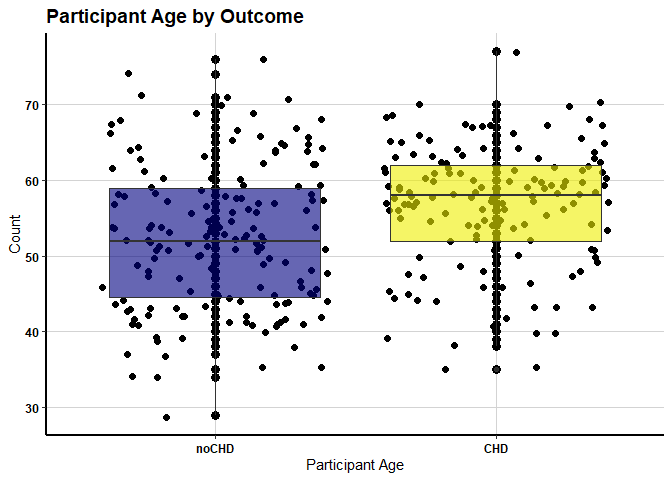
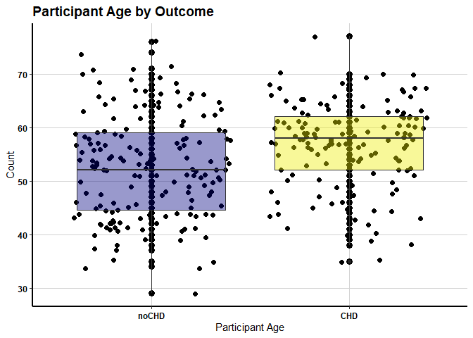
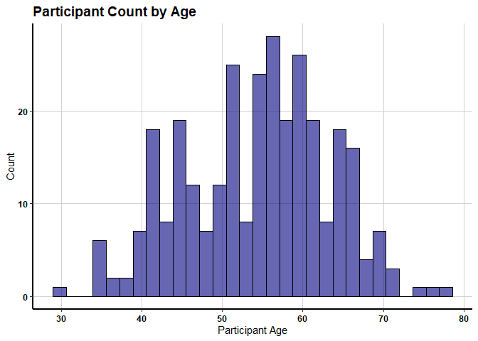
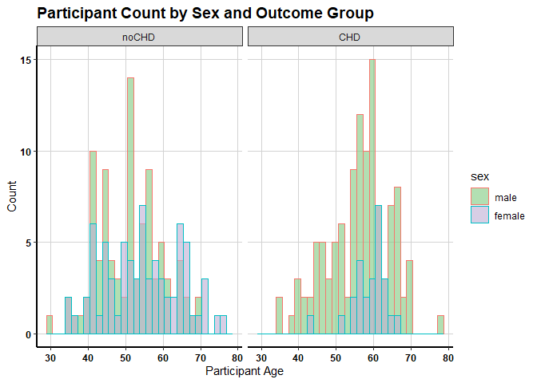

Sample Healthcare Analysis Using Cleveland Heart Disease Data
================
Paul G. Smith
10/29/2019

  - [Read in the data set](#read-in-the-data-set)
  - [Convert the variables into formats we
    need](#convert-the-variables-into-formats-we-need)
  - [Create the outcome variables.](#create-the-outcome-variables.)
  - [Write the data set](#write-the-data-set)
  - [Create some boxplots](#create-some-boxplots)

## Read in the data set

``` r
# Read in the inital cleveland data set
source("100_Read in cleveland data.R", echo = TRUE)
```

    ## 
    ## > chd <- read.csv2("./data/cleveland.csv", sep = ",", 
    ## +     as.is = TRUE)
    ## 
    ## > colnames(chd) <- c("age", "sex", "cp", "trestbps", 
    ## +     "chol", "fbs", "restecg", "thalach", "exang", "oldpeak", 
    ## +     "slope", "ca", "thal", "ou ..." ... [TRUNCATED] 
    ## 
    ## > str(chd)
    ## 'data.frame':    302 obs. of  14 variables:
    ##  $ age     : chr  "67.0" "67.0" "37.0" "41.0" ...
    ##  $ sex     : chr  "1.0" "1.0" "1.0" "0.0" ...
    ##  $ cp      : chr  "4.0" "4.0" "3.0" "2.0" ...
    ##  $ trestbps: chr  "160.0" "120.0" "130.0" "130.0" ...
    ##  $ chol    : chr  "286.0" "229.0" "250.0" "204.0" ...
    ##  $ fbs     : chr  "0.0" "0.0" "0.0" "0.0" ...
    ##  $ restecg : chr  "2.0" "2.0" "0.0" "2.0" ...
    ##  $ thalach : chr  "108.0" "129.0" "187.0" "172.0" ...
    ##  $ exang   : chr  "1.0" "1.0" "0.0" "0.0" ...
    ##  $ oldpeak : chr  "1.5" "2.6" "3.5" "1.4" ...
    ##  $ slope   : chr  "2.0" "2.0" "3.0" "1.0" ...
    ##  $ ca      : chr  "3.0" "2.0" "0.0" "0.0" ...
    ##  $ thal    : chr  "3.0" "7.0" "3.0" "3.0" ...
    ##  $ outcome : int  2 1 0 0 0 3 0 2 1 0 ...

## Convert the variables into formats we need

``` r
# Convert the variables
source("105_Convert variables.R", echo = TRUE)
```

    ## 
    ## > chd$age <- as.numeric(chd$age)
    ## 
    ## > chd$sex <- as.factor(as.integer(chd$sex))
    ## 
    ## > levels(chd$sex) <- c("female", "male")
    ## 
    ## > chd$cp <- as.factor(as.integer(chd$cp))
    ## 
    ## > levels(chd$cp) <- c("typical angina", "atypical angina", 
    ## +     "non-anginal pain", "asymptomatic")
    ## 
    ## > chd$trestbps <- as.numeric(chd$trestbps)
    ## 
    ## > chd$chol <- as.numeric(chd$chol)
    ## 
    ## > chd$fbs <- as.logical(as.integer(chd$fbs))
    ## 
    ## > chd$restecg <- as.factor(as.integer(chd$restecg))
    ## 
    ## > levels(chd$restecg) <- c("normal", "ST-T wave abnormality", 
    ## +     "left ventricular hypertrophy")
    ## 
    ## > chd$thalach <- as.numeric(chd$thalach)
    ## 
    ## > chd$exang <- as.factor(as.integer(chd$exang))
    ## 
    ## > levels(chd$exang) <- c("no", "yes")
    ## 
    ## > chd$slope <- as.factor(as.integer(chd$slope))
    ## 
    ## > levels(chd$slope) <- c("upsloping", "flat", "downsloping")
    ## 
    ## > chd$ca <- as.numeric(chd$ca)

    ## Warning in eval(ei, envir): NAs introduced by coercion

    ## 
    ## > chd$thal <- as.factor(as.integer(chd$thal))

    ## Warning in is.factor(x): NAs introduced by coercion

    ## 
    ## > levels(chd$thal) <- c("normal", "fixed defect", "reversable defect")
    ## 
    ## > chd$outcome <- as.factor(as.integer(chd$outcome))

## Create the outcome variables.

``` r
# Create outcome variables
source("110_Create outcome variables.R", echo = TRUE)
```

    ## 
    ## > group1 <- chd[chd$outcome == 0, ]
    ## 
    ## > group2 <- chd[chd$outcome != 0, ]
    ## 
    ## > nrow(group1) + nrow(group2)
    ## [1] 302

## Write the data set

``` r
# write the data set
source("190_Write out chd.R", echo = TRUE)
```

    ## 
    ## > write.csv(chd, file = "./data/chd.csv")
    ## 
    ## > dim(chd)
    ## [1] 302  14
    ## 
    ## > colnames(chd)
    ##  [1] "age"      "sex"      "cp"       "trestbps" "chol"     "fbs"     
    ##  [7] "restecg"  "thalach"  "exang"    "oldpeak"  "slope"    "ca"      
    ## [13] "thal"     "outcome"

## Create some boxplots

``` r
# Read in the inital downloaded BRFSS dataset in SAS XPT format
source("200_Boxplots.R", echo = TRUE)
```

    ## 
    ## > library(ggplot2)
    ## 
    ## > library(dplyr)

    ## 
    ## Attaching package: 'dplyr'

    ## The following objects are masked from 'package:stats':
    ## 
    ##     filter, lag

    ## The following objects are masked from 'package:base':
    ## 
    ##     intersect, setdiff, setequal, union

    ## 
    ## > chd <- read.csv("./data/chd.csv", header = TRUE, sep = ",")
    ## 
    ## > boxplot(group1$age, group2$age, col = "CadetBlue", 
    ## +     pch = 20, names = c("CHD absent", "CHD present"), ylab = "Participant age")

<!-- -->

    ## 
    ## > groupCHD <- group2
    ## 
    ## > groupCHD$outcome <- c(1)
    ## 
    ## > CHDgroup <- rbind(group1, groupCHD)
    ## 
    ## > CHDgroup$outcome <- droplevels(CHDgroup$outcome)
    ## 
    ## > levels(CHDgroup$outcome) <- c("noCHD", "CHD")
    ## 
    ## > a <- ggplot(CHDgroup, aes(x = outcome, y = age))
    ## 
    ## > a + geom_boxplot()

<!-- -->

    ## 
    ## > a + geom_boxplot() + geom_point()

<!-- -->

    ## 
    ## > a + geom_boxplot() + geom_point() + geom_jitter()

<!-- -->

    ## 
    ## > a + geom_point(size = 3) + geom_jitter(size = 2) + 
    ## +     geom_boxplot(alpha = 0.4, fill = c("navy", "yellow2"))

<!-- -->

    ## 
    ## > a + geom_point(size = 3) + geom_jitter(size = 2) + 
    ## +     geom_boxplot(alpha = 0.4, fill = c("navy", "yellow2")) + 
    ## +     labs(title = "Participant  ..." ... [TRUNCATED]

    ## Warning in grid.Call(C_stringMetric, as.graphicsAnnot(x$label)): font
    ## family not found in Windows font database
    
    ## Warning in grid.Call(C_stringMetric, as.graphicsAnnot(x$label)): font
    ## family not found in Windows font database
    
    ## Warning in grid.Call(C_stringMetric, as.graphicsAnnot(x$label)): font
    ## family not found in Windows font database

    ## Warning in grid.Call(C_textBounds, as.graphicsAnnot(x$label), x$x, x$y, :
    ## font family not found in Windows font database
    
    ## Warning in grid.Call(C_textBounds, as.graphicsAnnot(x$label), x$x, x$y, :
    ## font family not found in Windows font database
    
    ## Warning in grid.Call(C_textBounds, as.graphicsAnnot(x$label), x$x, x$y, :
    ## font family not found in Windows font database
    
    ## Warning in grid.Call(C_textBounds, as.graphicsAnnot(x$label), x$x, x$y, :
    ## font family not found in Windows font database
    
    ## Warning in grid.Call(C_textBounds, as.graphicsAnnot(x$label), x$x, x$y, :
    ## font family not found in Windows font database
    
    ## Warning in grid.Call(C_textBounds, as.graphicsAnnot(x$label), x$x, x$y, :
    ## font family not found in Windows font database
    
    ## Warning in grid.Call(C_textBounds, as.graphicsAnnot(x$label), x$x, x$y, :
    ## font family not found in Windows font database
    
    ## Warning in grid.Call(C_textBounds, as.graphicsAnnot(x$label), x$x, x$y, :
    ## font family not found in Windows font database
    
    ## Warning in grid.Call(C_textBounds, as.graphicsAnnot(x$label), x$x, x$y, :
    ## font family not found in Windows font database
    
    ## Warning in grid.Call(C_textBounds, as.graphicsAnnot(x$label), x$x, x$y, :
    ## font family not found in Windows font database

    ## Warning in grid.Call.graphics(C_text, as.graphicsAnnot(x$label), x$x,
    ## x$y, : font family not found in Windows font database

    ## Warning in grid.Call(C_textBounds, as.graphicsAnnot(x$label), x$x, x$y, :
    ## font family not found in Windows font database

<!-- --> \#\# Create some
histograms and other stuff

``` r
# Read in the inital downloaded BRFSS dataset in SAS XPT format
source("205_Histograms.R", echo = TRUE)
```

    ## 
    ## > library(ggplot2)
    ## 
    ## > library(dplyr)
    ## 
    ## > chd <- read.csv("./data/chd.csv", header = TRUE, sep = ",")
    ## 
    ## > b <- ggplot(CHDgroup, aes(x = age))
    ## 
    ## > b + geom_histogram(bins = 30)

<!-- -->

    ## 
    ## > b + geom_histogram(bins = 30, color = "black", fill = "navy", 
    ## +     alpha = 0.4) + labs(title = "Participant Count by Age", y = "Count", 
    ## +     x = .... [TRUNCATED]

    ## Warning in grid.Call(C_textBounds, as.graphicsAnnot(x$label), x$x, x$y, :
    ## font family not found in Windows font database
    
    ## Warning in grid.Call(C_textBounds, as.graphicsAnnot(x$label), x$x, x$y, :
    ## font family not found in Windows font database
    
    ## Warning in grid.Call(C_textBounds, as.graphicsAnnot(x$label), x$x, x$y, :
    ## font family not found in Windows font database
    
    ## Warning in grid.Call(C_textBounds, as.graphicsAnnot(x$label), x$x, x$y, :
    ## font family not found in Windows font database
    
    ## Warning in grid.Call(C_textBounds, as.graphicsAnnot(x$label), x$x, x$y, :
    ## font family not found in Windows font database
    
    ## Warning in grid.Call(C_textBounds, as.graphicsAnnot(x$label), x$x, x$y, :
    ## font family not found in Windows font database
    
    ## Warning in grid.Call(C_textBounds, as.graphicsAnnot(x$label), x$x, x$y, :
    ## font family not found in Windows font database
    
    ## Warning in grid.Call(C_textBounds, as.graphicsAnnot(x$label), x$x, x$y, :
    ## font family not found in Windows font database
    
    ## Warning in grid.Call(C_textBounds, as.graphicsAnnot(x$label), x$x, x$y, :
    ## font family not found in Windows font database
    
    ## Warning in grid.Call(C_textBounds, as.graphicsAnnot(x$label), x$x, x$y, :
    ## font family not found in Windows font database

    ## Warning in grid.Call.graphics(C_text, as.graphicsAnnot(x$label), x$x,
    ## x$y, : font family not found in Windows font database

    ## Warning in grid.Call(C_textBounds, as.graphicsAnnot(x$label), x$x, x$y, :
    ## font family not found in Windows font database

<!-- -->

    ## 
    ## > ggplot(CHDgroup, aes(sex)) + geom_bar(fill = c("navy", 
    ## +     "yellow2"), alpha = 0.4) + labs(title = "Participant Count by Sex", 
    ## +     y = "Count" .... [TRUNCATED]

    ## Warning in grid.Call(C_textBounds, as.graphicsAnnot(x$label), x$x, x$y, :
    ## font family not found in Windows font database
    
    ## Warning in grid.Call(C_textBounds, as.graphicsAnnot(x$label), x$x, x$y, :
    ## font family not found in Windows font database
    
    ## Warning in grid.Call(C_textBounds, as.graphicsAnnot(x$label), x$x, x$y, :
    ## font family not found in Windows font database
    
    ## Warning in grid.Call(C_textBounds, as.graphicsAnnot(x$label), x$x, x$y, :
    ## font family not found in Windows font database
    
    ## Warning in grid.Call(C_textBounds, as.graphicsAnnot(x$label), x$x, x$y, :
    ## font family not found in Windows font database
    
    ## Warning in grid.Call(C_textBounds, as.graphicsAnnot(x$label), x$x, x$y, :
    ## font family not found in Windows font database
    
    ## Warning in grid.Call(C_textBounds, as.graphicsAnnot(x$label), x$x, x$y, :
    ## font family not found in Windows font database
    
    ## Warning in grid.Call(C_textBounds, as.graphicsAnnot(x$label), x$x, x$y, :
    ## font family not found in Windows font database
    
    ## Warning in grid.Call(C_textBounds, as.graphicsAnnot(x$label), x$x, x$y, :
    ## font family not found in Windows font database
    
    ## Warning in grid.Call(C_textBounds, as.graphicsAnnot(x$label), x$x, x$y, :
    ## font family not found in Windows font database

    ## Warning in grid.Call.graphics(C_text, as.graphicsAnnot(x$label), x$x,
    ## x$y, : font family not found in Windows font database

    ## Warning in grid.Call(C_textBounds, as.graphicsAnnot(x$label), x$x, x$y, :
    ## font family not found in Windows font database

<!-- -->

    ## 
    ## > df <- CHDgroup %>% group_by(sex) %>% summarize(counts = n())
    ## 
    ## > df
    ## # A tibble: 2 x 2
    ##   sex    counts
    ##   <fct>   <int>
    ## 1 female     97
    ## 2 male      205
    ## 
    ## > c <- ggplot(df, aes(x = sex, y = counts))
    ## 
    ## > c + geom_bar(stat = "identity") + geom_text(aes(label = counts), 
    ## +     vjust = -0.3) + labs(title = "Participant Count by Sex", 
    ## +     y = "Count", .... [TRUNCATED]

    ## Warning in grid.Call(C_textBounds, as.graphicsAnnot(x$label), x$x, x$y, :
    ## font family not found in Windows font database
    
    ## Warning in grid.Call(C_textBounds, as.graphicsAnnot(x$label), x$x, x$y, :
    ## font family not found in Windows font database
    
    ## Warning in grid.Call(C_textBounds, as.graphicsAnnot(x$label), x$x, x$y, :
    ## font family not found in Windows font database
    
    ## Warning in grid.Call(C_textBounds, as.graphicsAnnot(x$label), x$x, x$y, :
    ## font family not found in Windows font database
    
    ## Warning in grid.Call(C_textBounds, as.graphicsAnnot(x$label), x$x, x$y, :
    ## font family not found in Windows font database
    
    ## Warning in grid.Call(C_textBounds, as.graphicsAnnot(x$label), x$x, x$y, :
    ## font family not found in Windows font database
    
    ## Warning in grid.Call(C_textBounds, as.graphicsAnnot(x$label), x$x, x$y, :
    ## font family not found in Windows font database
    
    ## Warning in grid.Call(C_textBounds, as.graphicsAnnot(x$label), x$x, x$y, :
    ## font family not found in Windows font database
    
    ## Warning in grid.Call(C_textBounds, as.graphicsAnnot(x$label), x$x, x$y, :
    ## font family not found in Windows font database
    
    ## Warning in grid.Call(C_textBounds, as.graphicsAnnot(x$label), x$x, x$y, :
    ## font family not found in Windows font database

    ## Warning in grid.Call.graphics(C_text, as.graphicsAnnot(x$label), x$x,
    ## x$y, : font family not found in Windows font database

    ## Warning in grid.Call(C_textBounds, as.graphicsAnnot(x$label), x$x, x$y, :
    ## font family not found in Windows font database

<!-- -->

    ## 
    ## > d <- ggplot(CHDgroup, aes(x = age))
    ## 
    ## > d + geom_histogram(bins = 30, aes(color = sex), fill = "white", 
    ## +     position = "identity") + scale_color_manual(values = c("#00AFBB", 
    ## +     "#E7 ..." ... [TRUNCATED]

<!-- -->

    ## 
    ## > d + geom_histogram(aes(color = sex, fill = sex), alpha = 0.4, 
    ## +     position = "identity") + labs(title = "Participant Count by Age and Sex", 
    ## +    .... [TRUNCATED]

    ## `stat_bin()` using `bins = 30`. Pick better value with `binwidth`.

    ## Warning in grid.Call(C_textBounds, as.graphicsAnnot(x$label), x$x, x$y, :
    ## font family not found in Windows font database

    ## Warning in grid.Call(C_stringMetric, as.graphicsAnnot(x$label)): font
    ## family not found in Windows font database

    ## Warning in grid.Call(C_textBounds, as.graphicsAnnot(x$label), x$x, x$y, :
    ## font family not found in Windows font database
    
    ## Warning in grid.Call(C_textBounds, as.graphicsAnnot(x$label), x$x, x$y, :
    ## font family not found in Windows font database
    
    ## Warning in grid.Call(C_textBounds, as.graphicsAnnot(x$label), x$x, x$y, :
    ## font family not found in Windows font database
    
    ## Warning in grid.Call(C_textBounds, as.graphicsAnnot(x$label), x$x, x$y, :
    ## font family not found in Windows font database
    
    ## Warning in grid.Call(C_textBounds, as.graphicsAnnot(x$label), x$x, x$y, :
    ## font family not found in Windows font database
    
    ## Warning in grid.Call(C_textBounds, as.graphicsAnnot(x$label), x$x, x$y, :
    ## font family not found in Windows font database
    
    ## Warning in grid.Call(C_textBounds, as.graphicsAnnot(x$label), x$x, x$y, :
    ## font family not found in Windows font database
    
    ## Warning in grid.Call(C_textBounds, as.graphicsAnnot(x$label), x$x, x$y, :
    ## font family not found in Windows font database
    
    ## Warning in grid.Call(C_textBounds, as.graphicsAnnot(x$label), x$x, x$y, :
    ## font family not found in Windows font database
    
    ## Warning in grid.Call(C_textBounds, as.graphicsAnnot(x$label), x$x, x$y, :
    ## font family not found in Windows font database

    ## Warning in grid.Call.graphics(C_text, as.graphicsAnnot(x$label), x$x,
    ## x$y, : font family not found in Windows font database

    ## Warning in grid.Call(C_textBounds, as.graphicsAnnot(x$label), x$x, x$y, :
    ## font family not found in Windows font database
    
    ## Warning in grid.Call(C_textBounds, as.graphicsAnnot(x$label), x$x, x$y, :
    ## font family not found in Windows font database
    
    ## Warning in grid.Call(C_textBounds, as.graphicsAnnot(x$label), x$x, x$y, :
    ## font family not found in Windows font database

<!-- -->

    ## 
    ## > df <- CHDgroup
    ## 
    ## > df$sex <- factor(df$sex, levels = levels(df$sex)[order(levels(df$sex), 
    ## +     decreasing = T)])
    ## 
    ## > e <- ggplot(df, aes(x = age))
    ## 
    ## > e + geom_histogram(bins = 30, aes(color = sex, fill = sex), 
    ## +     alpha = 0.4, position = "identity") + scale_color_manual(values = c("navy", 
    ## +    .... [TRUNCATED]

<!-- -->

    ## 
    ## > e + geom_histogram(bins = 30, aes(color = sex, fill = sex), 
    ## +     alpha = 0.4, position = "identity") + labs(title = "Participant Count by Sex and  ..." ... [TRUNCATED]

<!-- -->

    ## 
    ## > e + geom_histogram(bins = 30, aes(color = sex, fill = sex), 
    ## +     alpha = 0.4, position = "identity") + labs(title = "Participant Count by Sex and  ..." ... [TRUNCATED]

    ## Warning in grid.Call(C_stringMetric, as.graphicsAnnot(x$label)): font
    ## family not found in Windows font database
    
    ## Warning in grid.Call(C_stringMetric, as.graphicsAnnot(x$label)): font
    ## family not found in Windows font database
    
    ## Warning in grid.Call(C_stringMetric, as.graphicsAnnot(x$label)): font
    ## family not found in Windows font database
    
    ## Warning in grid.Call(C_stringMetric, as.graphicsAnnot(x$label)): font
    ## family not found in Windows font database
    
    ## Warning in grid.Call(C_stringMetric, as.graphicsAnnot(x$label)): font
    ## family not found in Windows font database
    
    ## Warning in grid.Call(C_stringMetric, as.graphicsAnnot(x$label)): font
    ## family not found in Windows font database
    
    ## Warning in grid.Call(C_stringMetric, as.graphicsAnnot(x$label)): font
    ## family not found in Windows font database
    
    ## Warning in grid.Call(C_stringMetric, as.graphicsAnnot(x$label)): font
    ## family not found in Windows font database
    
    ## Warning in grid.Call(C_stringMetric, as.graphicsAnnot(x$label)): font
    ## family not found in Windows font database

    ## Warning in grid.Call.graphics(C_text, as.graphicsAnnot(x$label), x$x,
    ## x$y, : font family not found in Windows font database

    ## Warning in grid.Call(C_textBounds, as.graphicsAnnot(x$label), x$x, x$y, :
    ## font family not found in Windows font database
    
    ## Warning in grid.Call(C_textBounds, as.graphicsAnnot(x$label), x$x, x$y, :
    ## font family not found in Windows font database

    ## Warning in grid.Call.graphics(C_text, as.graphicsAnnot(x$label), x$x,
    ## x$y, : font family not found in Windows font database

    ## Warning in grid.Call(C_textBounds, as.graphicsAnnot(x$label), x$x, x$y, :
    ## font family not found in Windows font database
    
    ## Warning in grid.Call(C_textBounds, as.graphicsAnnot(x$label), x$x, x$y, :
    ## font family not found in Windows font database
    
    ## Warning in grid.Call(C_textBounds, as.graphicsAnnot(x$label), x$x, x$y, :
    ## font family not found in Windows font database

<!-- -->
