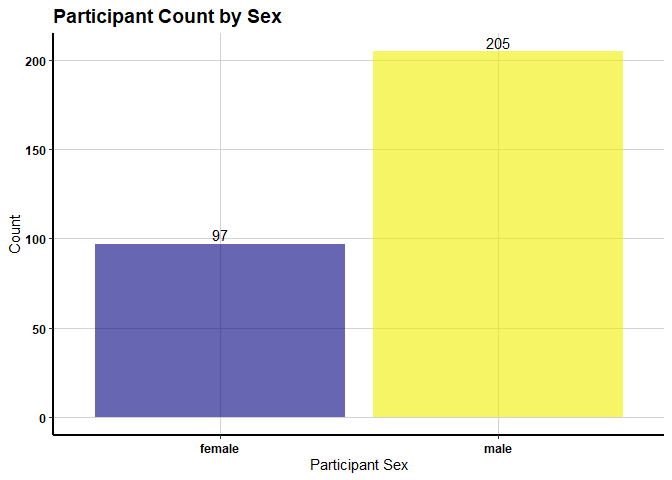
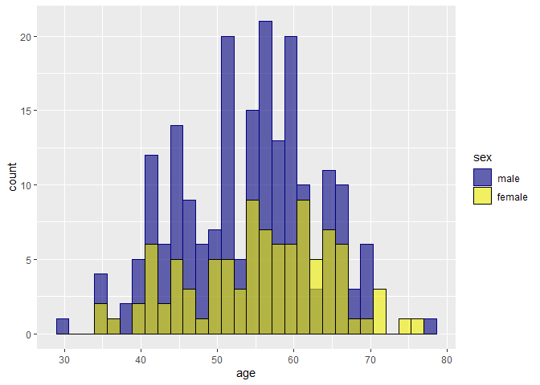

Sample Healthcare Analysis Using Cleveland Heart Disease Data
================
Paul G. Smith
10/29/2019

  - [Read in the data set](#read-in-the-data-set)
  - [Convert the variables into formats we
    need](#convert-the-variables-into-formats-we-need)
  - [Create the outcome variables.](#create-the-outcome-variables.)
  - [Write the data set](#write-the-data-set)
  - [Create some boxplots](#create-some-boxplots)
  - [Publication Request:](#publication-request)
  - [Original database Description](#original-database-description)

## Read in the data set

``` r
# Read in the inital cleveland data set
source("100_Read in cleveland data.R", echo = TRUE)
```

    ## 
    ## > chd <- read.csv2("./data/cleveland.csv", sep = ",", 
    ## +     as.is = TRUE)
    ## 
    ## > colnames(chd) <- c("age", "sex", "cp", "trestbps", 
    ## +     "chol", "fbs", "restecg", "thalach", "exang", "oldpeak", 
    ## +     "slope", "ca", "thal", "ou ..." ... [TRUNCATED] 
    ## 
    ## > str(chd)
    ## 'data.frame':    302 obs. of  14 variables:
    ##  $ age     : chr  "67.0" "67.0" "37.0" "41.0" ...
    ##  $ sex     : chr  "1.0" "1.0" "1.0" "0.0" ...
    ##  $ cp      : chr  "4.0" "4.0" "3.0" "2.0" ...
    ##  $ trestbps: chr  "160.0" "120.0" "130.0" "130.0" ...
    ##  $ chol    : chr  "286.0" "229.0" "250.0" "204.0" ...
    ##  $ fbs     : chr  "0.0" "0.0" "0.0" "0.0" ...
    ##  $ restecg : chr  "2.0" "2.0" "0.0" "2.0" ...
    ##  $ thalach : chr  "108.0" "129.0" "187.0" "172.0" ...
    ##  $ exang   : chr  "1.0" "1.0" "0.0" "0.0" ...
    ##  $ oldpeak : chr  "1.5" "2.6" "3.5" "1.4" ...
    ##  $ slope   : chr  "2.0" "2.0" "3.0" "1.0" ...
    ##  $ ca      : chr  "3.0" "2.0" "0.0" "0.0" ...
    ##  $ thal    : chr  "3.0" "7.0" "3.0" "3.0" ...
    ##  $ outcome : int  2 1 0 0 0 3 0 2 1 0 ...

## Convert the variables into formats we need

``` r
# Convert the variables
source("105_Convert variables.R", echo = TRUE)
```

    ## 
    ## > chd$age <- as.numeric(chd$age)
    ## 
    ## > chd$sex <- as.factor(as.integer(chd$sex))
    ## 
    ## > levels(chd$sex) <- c("female", "male")
    ## 
    ## > chd$cp <- as.factor(as.integer(chd$cp))
    ## 
    ## > levels(chd$cp) <- c("typical angina", "atypical angina", 
    ## +     "non-anginal pain", "asymptomatic")
    ## 
    ## > chd$trestbps <- as.numeric(chd$trestbps)
    ## 
    ## > chd$chol <- as.numeric(chd$chol)
    ## 
    ## > chd$fbs <- as.logical(as.integer(chd$fbs))
    ## 
    ## > chd$restecg <- as.factor(as.integer(chd$restecg))
    ## 
    ## > levels(chd$restecg) <- c("normal", "ST-T wave abnormality", 
    ## +     "left ventricular hypertrophy")
    ## 
    ## > chd$thalach <- as.numeric(chd$thalach)
    ## 
    ## > chd$exang <- as.factor(as.integer(chd$exang))
    ## 
    ## > levels(chd$exang) <- c("no", "yes")
    ## 
    ## > chd$slope <- as.factor(as.integer(chd$slope))
    ## 
    ## > levels(chd$slope) <- c("upsloping", "flat", "downsloping")
    ## 
    ## > chd$ca <- as.numeric(chd$ca)

    ## Warning in eval(ei, envir): NAs introduced by coercion

    ## 
    ## > chd$thal <- as.factor(as.integer(chd$thal))

    ## Warning in is.factor(x): NAs introduced by coercion

    ## 
    ## > levels(chd$thal) <- c("normal", "fixed defect", "reversable defect")
    ## 
    ## > chd$outcome <- as.factor(as.integer(chd$outcome))

## Create the outcome variables.

``` r
# Create outcome variables
source("110_Create outcome variables.R", echo = TRUE)
```

    ## 
    ## > group1 <- chd[chd$outcome == 0, ]
    ## 
    ## > group2 <- chd[chd$outcome != 0, ]
    ## 
    ## > nrow(group1) + nrow(group2)
    ## [1] 302

## Write the data set

``` r
# write the data set
source("190_Write out chd.R", echo = TRUE)
```

    ## 
    ## > write.csv(chd, file = "./data/chd.csv")
    ## 
    ## > dim(chd)
    ## [1] 302  14
    ## 
    ## > colnames(chd)
    ##  [1] "age"      "sex"      "cp"       "trestbps" "chol"     "fbs"     
    ##  [7] "restecg"  "thalach"  "exang"    "oldpeak"  "slope"    "ca"      
    ## [13] "thal"     "outcome"

## Create some boxplots

``` r
# Create boxplots
source("200_Boxplots.R", echo = TRUE)
```

    ## 
    ## > library(ggplot2)
    ## 
    ## > library(dplyr)

    ## 
    ## Attaching package: 'dplyr'

    ## The following objects are masked from 'package:stats':
    ## 
    ##     filter, lag

    ## The following objects are masked from 'package:base':
    ## 
    ##     intersect, setdiff, setequal, union

    ## 
    ## > chd <- data.frame(read.csv("./data/chd.csv", header = TRUE, 
    ## +     sep = ","))
    ## 
    ## > groupCHD <- group2
    ## 
    ## > groupCHD$outcome <- c(1)
    ## 
    ## > CHDgroup <- rbind(group1, groupCHD)
    ## 
    ## > CHDgroup$outcome <- droplevels(CHDgroup$outcome)
    ## 
    ## > levels(CHDgroup$outcome) <- c("noCHD", "CHD")
    ## 
    ## > typeof(CHDgroup$outcome)
    ## [1] "integer"
    ## 
    ## > a <- ggplot(CHDgroup, aes(x = outcome, y = age, ))
    ## 
    ## > a + geom_point(size = 3) + geom_jitter(size = 2) + 
    ## +     geom_boxplot(alpha = 0.6, fill = c("navy", "yellow2")) + 
    ## +     labs(title = "Participant  ..." ... [TRUNCATED]

    ## Warning in grid.Call(C_stringMetric, as.graphicsAnnot(x$label)): font
    ## family not found in Windows font database
    
    ## Warning in grid.Call(C_stringMetric, as.graphicsAnnot(x$label)): font
    ## family not found in Windows font database
    
    ## Warning in grid.Call(C_stringMetric, as.graphicsAnnot(x$label)): font
    ## family not found in Windows font database

    ## Warning in grid.Call(C_textBounds, as.graphicsAnnot(x$label), x$x, x$y, :
    ## font family not found in Windows font database
    
    ## Warning in grid.Call(C_textBounds, as.graphicsAnnot(x$label), x$x, x$y, :
    ## font family not found in Windows font database
    
    ## Warning in grid.Call(C_textBounds, as.graphicsAnnot(x$label), x$x, x$y, :
    ## font family not found in Windows font database
    
    ## Warning in grid.Call(C_textBounds, as.graphicsAnnot(x$label), x$x, x$y, :
    ## font family not found in Windows font database
    
    ## Warning in grid.Call(C_textBounds, as.graphicsAnnot(x$label), x$x, x$y, :
    ## font family not found in Windows font database
    
    ## Warning in grid.Call(C_textBounds, as.graphicsAnnot(x$label), x$x, x$y, :
    ## font family not found in Windows font database
    
    ## Warning in grid.Call(C_textBounds, as.graphicsAnnot(x$label), x$x, x$y, :
    ## font family not found in Windows font database
    
    ## Warning in grid.Call(C_textBounds, as.graphicsAnnot(x$label), x$x, x$y, :
    ## font family not found in Windows font database
    
    ## Warning in grid.Call(C_textBounds, as.graphicsAnnot(x$label), x$x, x$y, :
    ## font family not found in Windows font database
    
    ## Warning in grid.Call(C_textBounds, as.graphicsAnnot(x$label), x$x, x$y, :
    ## font family not found in Windows font database

    ## Warning in grid.Call.graphics(C_text, as.graphicsAnnot(x$label), x$x,
    ## x$y, : font family not found in Windows font database

    ## Warning in grid.Call(C_textBounds, as.graphicsAnnot(x$label), x$x, x$y, :
    ## font family not found in Windows font database

<!-- --> \#\# Create some
histograms and other stuff

``` r
# Create histograms
source("205_Histograms.R", echo = TRUE)
```

    ## 
    ## > library(ggplot2)
    ## 
    ## > library(dplyr)
    ## 
    ## > chd <- read.csv("./data/chd.csv", header = TRUE, sep = ",")
    ## 
    ## > b <- ggplot(CHDgroup, aes(x = age))
    ## 
    ## > b + geom_histogram(bins = 30, color = "black", fill = "navy", 
    ## +     alpha = 0.6) + labs(title = "Participant Count by Age", y = "Count", 
    ## +     x = .... [TRUNCATED]

    ## Warning in grid.Call(C_textBounds, as.graphicsAnnot(x$label), x$x, x$y, :
    ## font family not found in Windows font database
    
    ## Warning in grid.Call(C_textBounds, as.graphicsAnnot(x$label), x$x, x$y, :
    ## font family not found in Windows font database
    
    ## Warning in grid.Call(C_textBounds, as.graphicsAnnot(x$label), x$x, x$y, :
    ## font family not found in Windows font database
    
    ## Warning in grid.Call(C_textBounds, as.graphicsAnnot(x$label), x$x, x$y, :
    ## font family not found in Windows font database
    
    ## Warning in grid.Call(C_textBounds, as.graphicsAnnot(x$label), x$x, x$y, :
    ## font family not found in Windows font database
    
    ## Warning in grid.Call(C_textBounds, as.graphicsAnnot(x$label), x$x, x$y, :
    ## font family not found in Windows font database
    
    ## Warning in grid.Call(C_textBounds, as.graphicsAnnot(x$label), x$x, x$y, :
    ## font family not found in Windows font database
    
    ## Warning in grid.Call(C_textBounds, as.graphicsAnnot(x$label), x$x, x$y, :
    ## font family not found in Windows font database
    
    ## Warning in grid.Call(C_textBounds, as.graphicsAnnot(x$label), x$x, x$y, :
    ## font family not found in Windows font database
    
    ## Warning in grid.Call(C_textBounds, as.graphicsAnnot(x$label), x$x, x$y, :
    ## font family not found in Windows font database

    ## Warning in grid.Call.graphics(C_text, as.graphicsAnnot(x$label), x$x,
    ## x$y, : font family not found in Windows font database

    ## Warning in grid.Call(C_textBounds, as.graphicsAnnot(x$label), x$x, x$y, :
    ## font family not found in Windows font database

<!-- -->

    ## 
    ## > df <- CHDgroup %>% group_by(sex) %>% summarize(counts = n())
    ## 
    ## > df
    ## # A tibble: 2 x 2
    ##   sex    counts
    ##   <fct>   <int>
    ## 1 female     97
    ## 2 male      205
    ## 
    ## > c <- ggplot(df, aes(x = sex, y = counts))
    ## 
    ## > c + geom_bar(stat = "identity", fill = c("navy", "yellow2"), 
    ## +     alpha = 0.6) + geom_text(aes(label = counts), vjust = -0.3) + 
    ## +     labs(title  .... [TRUNCATED]

    ## Warning in grid.Call(C_textBounds, as.graphicsAnnot(x$label), x$x, x$y, :
    ## font family not found in Windows font database
    
    ## Warning in grid.Call(C_textBounds, as.graphicsAnnot(x$label), x$x, x$y, :
    ## font family not found in Windows font database
    
    ## Warning in grid.Call(C_textBounds, as.graphicsAnnot(x$label), x$x, x$y, :
    ## font family not found in Windows font database
    
    ## Warning in grid.Call(C_textBounds, as.graphicsAnnot(x$label), x$x, x$y, :
    ## font family not found in Windows font database
    
    ## Warning in grid.Call(C_textBounds, as.graphicsAnnot(x$label), x$x, x$y, :
    ## font family not found in Windows font database
    
    ## Warning in grid.Call(C_textBounds, as.graphicsAnnot(x$label), x$x, x$y, :
    ## font family not found in Windows font database
    
    ## Warning in grid.Call(C_textBounds, as.graphicsAnnot(x$label), x$x, x$y, :
    ## font family not found in Windows font database
    
    ## Warning in grid.Call(C_textBounds, as.graphicsAnnot(x$label), x$x, x$y, :
    ## font family not found in Windows font database
    
    ## Warning in grid.Call(C_textBounds, as.graphicsAnnot(x$label), x$x, x$y, :
    ## font family not found in Windows font database
    
    ## Warning in grid.Call(C_textBounds, as.graphicsAnnot(x$label), x$x, x$y, :
    ## font family not found in Windows font database

    ## Warning in grid.Call.graphics(C_text, as.graphicsAnnot(x$label), x$x,
    ## x$y, : font family not found in Windows font database

    ## Warning in grid.Call(C_textBounds, as.graphicsAnnot(x$label), x$x, x$y, :
    ## font family not found in Windows font database

<!-- -->

    ## 
    ## > df <- CHDgroup
    ## 
    ## > df$sex <- factor(df$sex, levels = levels(df$sex)[order(levels(df$sex), 
    ## +     decreasing = T)])
    ## 
    ## > e <- ggplot(df, aes(x = age))
    ## 
    ## > e + geom_histogram(bins = 30, aes(color = sex, fill = sex), 
    ## +     alpha = 0.6, position = "identity") + scale_color_manual(values = c("navy", 
    ## +    .... [TRUNCATED]

<!-- -->

    ## 
    ## > e + geom_histogram(bins = 30, aes(color = sex, fill = sex), 
    ## +     alpha = 0.6, position = "identity") + labs(title = "Participant Count by Sex and  ..." ... [TRUNCATED]

    ## Warning in grid.Call(C_stringMetric, as.graphicsAnnot(x$label)): font
    ## family not found in Windows font database
    
    ## Warning in grid.Call(C_stringMetric, as.graphicsAnnot(x$label)): font
    ## family not found in Windows font database
    
    ## Warning in grid.Call(C_stringMetric, as.graphicsAnnot(x$label)): font
    ## family not found in Windows font database

    ## Warning in grid.Call(C_stringMetric, as.graphicsAnnot(x$label)): font
    ## family not found in Windows font database

    ## Warning in grid.Call(C_textBounds, as.graphicsAnnot(x$label), x$x, x$y, :
    ## font family not found in Windows font database
    
    ## Warning in grid.Call(C_textBounds, as.graphicsAnnot(x$label), x$x, x$y, :
    ## font family not found in Windows font database
    
    ## Warning in grid.Call(C_textBounds, as.graphicsAnnot(x$label), x$x, x$y, :
    ## font family not found in Windows font database
    
    ## Warning in grid.Call(C_textBounds, as.graphicsAnnot(x$label), x$x, x$y, :
    ## font family not found in Windows font database
    
    ## Warning in grid.Call(C_textBounds, as.graphicsAnnot(x$label), x$x, x$y, :
    ## font family not found in Windows font database

    ## Warning in grid.Call.graphics(C_text, as.graphicsAnnot(x$label), x$x,
    ## x$y, : font family not found in Windows font database

    ## Warning in grid.Call(C_textBounds, as.graphicsAnnot(x$label), x$x, x$y, :
    ## font family not found in Windows font database
    
    ## Warning in grid.Call(C_textBounds, as.graphicsAnnot(x$label), x$x, x$y, :
    ## font family not found in Windows font database

    ## Warning in grid.Call.graphics(C_text, as.graphicsAnnot(x$label), x$x,
    ## x$y, : font family not found in Windows font database

    ## Warning in grid.Call(C_textBounds, as.graphicsAnnot(x$label), x$x, x$y, :
    ## font family not found in Windows font database
    
    ## Warning in grid.Call(C_textBounds, as.graphicsAnnot(x$label), x$x, x$y, :
    ## font family not found in Windows font database
    
    ## Warning in grid.Call(C_textBounds, as.graphicsAnnot(x$label), x$x, x$y, :
    ## font family not found in Windows font database

<!-- -->

## Publication Request:

This file describes the contents of the heart-disease directory.

This directory contains 4 databases concerning heart disease diagnosis.
All attributes are numeric-valued. The data was collected from the four
following locations:

``` 
 1. Cleveland Clinic Foundation (cleveland.data)
 2. Hungarian Institute of Cardiology, Budapest (hungarian.data)
 3. V.A. Medical Center, Long Beach, CA (long-beach-va.data)
 4. University Hospital, Zurich, Switzerland (switzerland.data)
```

Each database has the same instance format. While the databases have 76
raw attributes, only 14 of them are actually used. Thus I’ve taken the
liberty of making 2 copies of each database: one with all the attributes
and 1 with the 14 attributes actually used in past experiments.

The authors of the databases have requested:

``` 
  ...that any publications resulting from the use of the data include the 
  names of the principal investigator responsible for the data collection
  at each institution.  They would be:

   1. Hungarian Institute of Cardiology. Budapest: Andras Janosi, M.D.
   2. University Hospital, Zurich, Switzerland: William Steinbrunn, M.D.
   3. University Hospital, Basel, Switzerland: Matthias Pfisterer, M.D.
   4. V.A. Medical Center, Long Beach and Cleveland Clinic Foundation:
  Robert Detrano, M.D., Ph.D.
```

Thanks in advance for abiding by this request.

David Aha July 22, 1988

## Original database Description

1.  Title: Heart Disease Databases

2.  Source Information:
    
    1)  Creators: – 1. Hungarian Institute of Cardiology. Budapest:
        Andras Janosi, M.D. – 2. University Hospital, Zurich,
        Switzerland: William Steinbrunn, M.D. – 3. University Hospital,
        Basel, Switzerland: Matthias Pfisterer, M.D. – 4. V.A. Medical
        Center, Long Beach and Cleveland Clinic Foundation: Robert
        Detrano, M.D., Ph.D.
    2)  Donor: David W. Aha (<aha@ics.uci.edu>) (714) 856-8779  
    3)  Date: July, 1988

3.  Past Usage:
    
    1.  Detrano,\~R., Janosi,\~A., Steinbrunn,\~W., Pfisterer,\~M.,
        Schmid,<sub>J., Sandhu,</sub>S., Guppy,\~K., Lee,\~S., &
        Froelicher,\~V. (1989). {} {}, {},304–310. – International
        Probability Analysis – Address: Robert Detrano, M.D. Cardiology
        111-C V.A. Medical Center 5901 E. 7th Street Long Beach, CA
        90028 – Results in percent accuracy: (for 0.5 probability
        threshold) Data Name: CDF CADENZA – Hungarian 77 74 Long beach
        79 77 Swiss 81 81 – Approximately a 77% correct classification
        accuracy with a logistic-regression-derived discriminant
        function
    
    2.  ## David W. Aha & Dennis Kibler
        
        – Instance-based prediction of heart-disease presence with the
        Cleveland database – NTgrowth: 77.0% accuracy – C4: 74.8%
        accuracy
    
    3.  John Gennari – Gennari, J.\~H., Langley, P, & Fisher, D. (1989).
        Models of incremental concept formation. {}, 11–61. – Results: –
        The CLASSIT conceptual clustering system achieved a 78.9%
        accuracy on the Cleveland database.

4.  Relevant Information: This database contains 76 attributes, but all
    published experiments refer to using a subset of 14 of them. In
    particular, the Cleveland database is the only one that has been
    used by ML researchers to this date. The “goal” field refers to the
    presence of heart disease in the patient. It is integer valued from
    0 (no presence) to 4. Experiments with the Cleveland database have
    concentrated on simply attempting to distinguish presence (values
    1,2,3,4) from absence (value 0).
    
    The names and social security numbers of the patients were recently
    removed from the database, replaced with dummy values.
    
    One file has been “processed”, that one containing the Cleveland
    database. All four unprocessed files also exist in this directory.

5.  Number of Instances: Database: \# of instances: Cleveland: 303
    Hungarian: 294 Switzerland: 123 Long Beach VA: 200

6.  Number of Attributes: 76 (including the predicted attribute)

7.  Attribute Information: – Only 14 used – 1. \#3 (age)  
    – 2. \#4 (sex)  
    – 3. \#9 (cp)  
    – 4. \#10 (trestbps)  
    – 5. \#12 (chol)  
    – 6. \#16 (fbs)  
    – 7. \#19 (restecg)  
    – 8. \#32 (thalach)  
    – 9. \#38 (exang)  
    – 10. \#40 (oldpeak)  
    – 11. \#41 (slope)  
    – 12. \#44 (ca)  
    – 13. \#51 (thal)  
    – 14. \#58 (num) (the predicted attribute)
    
    – Complete attribute documentation: 1 age: age in years 2 sex: sex
    (1 = male; 0 = female) 3 cp: chest pain type – Value 1: typical
    angina – Value 2: atypical angina – Value 3: non-anginal pain –
    Value 4: asymptomatic 4 trestbps: resting blood pressure (in mm Hg
    on admission to the hospital) 5 chol: serum cholestoral in mg/dl
    
    6 fbs: (fasting blood sugar \> 120 mg/dl) (1 = true; 0 = false) 7
    restecg: resting electrocardiographic results – Value 0: normal –
    Value 1: having ST-T wave abnormality (T wave inversions and/or ST
    elevation or depression of \> 0.05 mV) – Value 2: showing probable
    or definite left ventricular hypertrophy by Estes’ criteria 8
    thalach: maximum heart rate achieved 9 exang: exercise induced
    angina (1 = yes; 0 = no) 10 oldpeak = ST depression induced by
    exercise relative to rest 11 slope: the slope of the peak exercise
    ST segment – Value 1: upsloping – Value 2: flat – Value 3:
    downsloping 12 ca: number of major vessels (0-3) colored by
    flourosopy 13 thal: 3 = normal; 6 = fixed defect; 7 = reversable
    defect 14 num: diagnosis of heart disease (angiographic disease
    status) – Value 0: \< 50% diameter narrowing – Value 1: \> 50%
    diameter narrowing (in any major vessel: attributes 59 through 68
    are vessels)

8.  Missing Attribute Values: Several. Distinguished with value -9.0.

9.  Class Distribution: Database: 0 1 2 3 4 Total Cleveland: 164 55 36
    35 13 303 Hungarian: 188 37 26 28 15 294 Switzerland: 8 48 32 30 5
    123 Long Beach VA: 51 56 41 42 10 200
